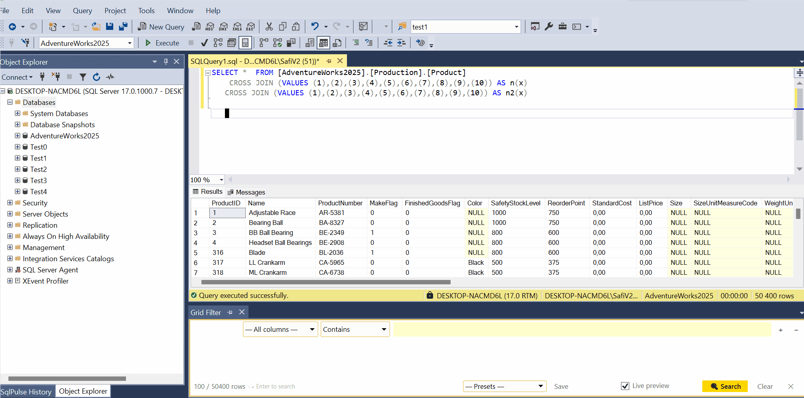

# SqlPulse - Productivity Extension for SSMS

[](https://learn.microsoft.com/en-us/sql/ssms/download-sql-server-management-studio-ssms)
[]()
[]()


**SqlPulse** is a productivity extension for SQL Server Management Studio that adds query history, result grid filtering, SQL code analysis, execution plan comparison, live SQL profiling, workspace management, and safety features to SSMS.

**[What's New](WHATSNEW.md)** -- SQL Profiler, Quick Connect, Connection Strip, Conditional Formatting, Transaction Guard, Blocking Tree, Dependency view, and more.

## Features

### Free

| Feature | Description |
|---------|-------------|
| **Query History** | Automatically captures every executed query. Search, filter by date, and replay with one click. |
| **Result Grid Filter** | Live row filtering directly in the SSMS result grid. Type to search across all columns instantly. |
| **Data Export** | Export result grids to XLSX, CSV or JSON. |
| **SQL Formatter** | Format T-SQL with configurable rules (keyword casing, indentation, newlines). |
| **Keyboard Shortcuts** | Configurable keyboard shortcuts for all major features (Profiler, History, Plan Analyzer, Object Search, SQL Inspector, Quick Connect, Format SQL, Script Object). Shortcuts only fire when SSMS is the active window. Configure via **Settings → Keyboard Shortcuts**. |
| **SQL Profiler** | Live query capture via Extended Events (XE). Unified event stream with per-type row coloring, grouped view, top CPU/duration/reads panels, blocking tree, wait stats, dev mode, export to CSV/JSON, and one-click plan analysis for slow queries. |
| **Transaction Guard** | Floating reminder when an open transaction is detected on the active query window. Auto-dismisses on commit or rollback. Enable and configure the check interval (1–60 s) via **Settings → Transaction Guard**. Requires `VIEW SERVER STATE` on the SQL Server login. |
| **Important DB Alert** | Configure server/database patterns (wildcards supported). A colored floating banner appears whenever you switch to a matching — typically production — database. |
| **Connection Strip** | A thin colored bar at the bottom of every query editor showing the current server and database. Color is configurable per connection in **Settings → Connections**. Toggle and resize there as well. |

#### Visuals

*Result Grid Filter*


*Data Export*


*Keyboard Shortcuts settings*


*Important DB Alert — colored banner on production database switch*


*Connection Strip — colored bar at the bottom of the query editor*


### Pro

| Feature | Description |
|---------|-------------|
| **SQL Code Inspector** | 50+ static analysis rules across 4 categories: modernization, performance, best practices, and security. AST-based detection using ScriptDom. |
| **Execution Plan Analyzer** | Visual plan tree, side-by-side plan comparison, table usage summary, and operator search within complex plans. |
| **Advanced Grid Filter** | Multi-condition filters with AND/OR logic and 9 operators (Contains, Regex, Equals, Starts With, etc.). |
| **Session Management** | Save and restore entire tab groups with connection contexts. Resume complex tasks exactly where you left off. |
| **Object Search** | Fast full-text search across all database objects (tables, views, procedures, functions) with cached metadata. |
| **Quick Connect** | Floating dropdown showing your preferred and recent connections. One click to open a new query window. Supports both Windows Auth and SQL Server Auth connections. Click **+ Add** in the header to add a new connection without leaving the dropdown. |
| **Tab Management** | Auto-rename and color-code query tabs based on environment. Red for Production, Green for Dev - prevent accidental executions. |
| **Grid Conditional Formatting** | Color result grid rows or cells based on column values — e.g. highlight ERROR rows in red, WARNING in orange. Define multiple rules with 13 operators (Contains, Regex, >, <, Is Empty, etc.). Built-in **zebra striping** (alternating row colors). Condition rules always override the zebra base layer. Applies instantly after each query. |
| **DB & Job Grouping** | Organize databases and SQL Agent jobs into colored groups in Object Explorer. |
| **Query Playbooks** | Define multi-step query workflows with connection overrides. Execute, track results, and export. |
| **Excel Export** | Export result grids to XLSX (OpenXML). |
| **Encrypted History** | AES-256 encrypted history storage with passphrase protection. |
| **SQL Server History Backend** | Store query history in a shared SQL Server table for team-wide access. |
| **Dependency view** | Quick dependency view from object search or from the the code thab when you select an object|

#### Visuals
*Grid Filter*


*Session Management*


*Object Explorer Database and Job Grouping*


*Object Search*


*SQL Code Inspector*


*SQL Profiler — live XE-based query capture with blocking tree and wait stats*


*SQL Profiler — top queries panel (CPU / duration / reads / wait types from captured events)*


*SQL Profiler — blocking tree view (blocker → blocked session hierarchy)*


*Quick Connect — preferred and recent connections dropdown*


*Grid Conditional Formatting — color rows and cells by column value*


*Zebra Rows — alternating row colors with condition rule override*


*Transaction Guard*


## Integration in SSMS

SqlPulse integrates seamlessly into SSMS via the Tools menu and context menus.

*Tools Menu*


*Query Editor Context Menu*


## Settings

SqlPulse is highly configurable to suit your workflow.

The settings dialog has a **built-in search box** at the top of the navigation panel. Type any keyword — feature name, setting label, or related term — to instantly filter and jump to the relevant page. For example, type `transaction` to go straight to Transaction Guard, or `shortcut` for Keyboard Shortcuts.


## Installation

### Setup Installer (Recommended)

1. Download the latest **SqlPulseInstaller.exe** from [Releases](https://github.com/IstvanSafar/SqlPulse/releases)
2. Run the installer
3. Restart SSMS
4. The **SqlPulse** menu appears under **Tools**


> The installer automatically detects all SSMS versions on your machine and installs the extension for each.

## Quick Start


| Action | How |
|--------|-----|
| Open Query History | **Tools** > **SqlPulse** > **Query History** |
| Filter Result Grid | Right-click result grid > **Filter Grid...** |
| Format SQL | **Tools** > **SqlPulse** > **Format SQL** |
| Inspect SQL Code | **Tools** > **SqlPulse** > **Analyze Query** |
| Analyze Execution Plan | **Tools** > **SqlPulse** > **Plan Analyzer** |
| Search Objects | **Tools** > **SqlPulse** > **Object Search** |
| Live SQL Profiler | **Tools** > **SqlPulse** > **SQL Profiler** |
| Quick Connect | **Tools** > **SqlPulse** > **Quick Connect** (also toolbar button) |
| Add new connection | **Settings → Connections → Add** or **Profiler → +** button (Free); **Quick Connect → + Add** (Pro) |
| Keyboard Shortcuts | **Tools** > **SqlPulse** > **Settings** > **Keyboard Shortcuts** |
| Connection Strip | Automatic — configure in **Settings → Connections** |
| Grid Conditional Formatting | **Settings** > **Grid Formatting (Pro)** — add rules (or enable Zebra Rows), then run a query |
| Transaction Guard | **Settings** > **Transaction Guard** — enable and set check interval |
| Open Settings | **Tools** > **SqlPulse** > **Settings** |

## Keyboard Shortcuts

All major features can be bound to custom keyboard shortcuts via **Tools → SqlPulse → Settings → Keyboard Shortcuts**.

Shortcuts only fire when SSMS is the active window — they will never interfere with other applications.

| Feature | Default |
|---------|---------|
| SQL Profiler | Ctrl+Shift+P (disabled by default) |
| Query History | Ctrl+Shift+H (disabled by default) |
| Plan Analyzer | — (disabled by default) |
| Object Search | — (disabled by default) |
| SQL Inspector | — (disabled by default) |
| Quick Connect | — (disabled by default) |
| Format SQL | — (disabled by default) |
| Script Object | Ctrl+Shift+S (enabled by default) |

## SQL Profiler

The SQL Profiler captures live query activity via Extended Events (XE) and displays it in a dockable tool window inside SSMS.

### Views

| View | Description |
|------|-------------|
| **Raw Stream** | Every captured event in arrival order. Color-coded by duration (orange = 100 ms+, red = 1 s+). |
| **Grouped View** | Events grouped by normalized SQL fingerprint — shows count, avg/max duration, total CPU and reads. |
| **Blocking Tree** | Hierarchical view of blocking chains. Root = blocker SPID, children = blocked sessions with wait type and duration. Empty when no blocking is detected. |

### Top Panels (last 30 seconds)

The toolbar shows four summary panels refreshed every polling cycle:

| Panel | Description |
|-------|-------------|
| **Top CPU** | Top 3 queries by CPU time |
| **Top Duration** | Top 3 queries by elapsed time |
| **Top Reads** | Top 3 queries by logical reads |
| **Top Waits** | Top 4 wait types by frequency — visible when **Wait stats** checkbox is enabled. Excludes `SLEEP*` and empty waits. |

### Memory Management

The profiler keeps captured events in memory with a configurable cap:

- **Max events** field (default: 5 000) — when the in-memory buffer exceeds this limit, the oldest 1 000 events are removed in a single batch trim.
- The status bar shows a live count: `3 241 stored` or `5 000 / 5 000 (capped)` when the cap is reached.
- The visible **Events** list is always capped at 2 000 rows for UI performance regardless of the stored count.

### Session File (Save to file)

Enable the **Save to file** checkbox to stream all captured events to a compressed JSONL file:

- File location: `%LOCALAPPDATA%\SqlPulseTool\profiler_YYYYMMDD_HHmmss.jsonl.gz`
- Format: one JSON object per line (JSONL), compressed with GZip
- Flushed every 100 events; also flushed on Clear and Stop
- Use `Export JSON` to export the current in-memory buffer to a flat JSON file

To read the session file:
```powershell
# Decompress and view in PowerShell:
$reader = [System.IO.StreamReader]::new(
    [System.IO.Compression.GZipStream]::new(
        [System.IO.File]::OpenRead("C:\...\profiler_20260316_120000.jsonl.gz"),
        [System.IO.Compression.CompressionMode]::Decompress))
while (($line = $reader.ReadLine()) -ne $null) { $line }
$reader.Close()
```

### Connecting

Type a server name in the server box or pick one from the dropdown (lists your preferred and recently used servers). Click **Start**.

- Click the **+** button next to the server dropdown to add a new preferred connection without leaving the Profiler. The settings dialog opens with a new connection ready to fill in — when you save and close, the new server appears in the dropdown.
- If the selected server is saved as a **SQL Server Auth** connection (username + password in **Settings → Connections**), the Profiler connects automatically using the stored credentials. No extra login prompt.
- If the selected server was auto-detected from the active SSMS editor, the existing SSMS connection is reused.
- Otherwise, Windows Authentication (`Integrated Security=SSPI`) is used.

### Modes

| Mode | Description |
|------|-------------|
| **Dev** | Captures only your own sessions (filtered by login name auto-detected from the active SSMS editor). |
| **DBA** | Captures all sessions on the server. |

### Filters

- **Hide system** — filters out `sp_reset_connection`, SSMS internal queries, and XE ring buffer reads.
- **Only slow (>500 ms)** — show only events above the slow threshold.
- **Alert > N ms** — highlights a "Slow query detected" banner in the status bar when any event exceeds the threshold. Optionally pauses capture automatically.
- **Text filter** — filters by SQL text, login, or database. Supports regular expressions.
- **Column filters** — right-click any row and use Filter by DB / Login / SPID.
- **Advanced filters** — expandable builder with AND/OR logic and 8 operators (Contains, Equals, Starts With, >, <=, etc.).

## Transaction Guard

Transaction Guard watches the active query window and shows a floating warning when an open transaction is detected. The banner auto-dismisses as soon as the transaction is committed or rolled back.

### Setup

1. Open **Tools → SqlPulse → Settings → Transaction Guard**
2. Check **Enable Transaction Guard**
3. Set the **Check interval** (1–60 seconds, default: 5 s)


*Transaction Guard — floating reminder for open transactions*


### Required permission

Transaction Guard reads `sys.dm_exec_sessions` to detect open transactions. The SQL Server login used in SSMS must have `VIEW SERVER STATE`. Without it the guard produces no warnings.

Grant the permission once per login:

```sql
GRANT VIEW SERVER STATE TO [your_login];
```

### How it works

- Every N seconds (configurable), SqlPulse queries `sys.dm_exec_sessions` for the specific session (`session_id`) of the active SSMS query window.
- If `open_transaction_count > 0`, the floating banner appears.
- Switching to another query window updates the guard to that window's session.
- Disabling Transaction Guard in Settings immediately stops polling and closes any open banner.

## Preferred Connections

Preferred Connections is the central list of servers you work with. Once configured, your connections appear in **Quick Connect**, power the **Connection Strip** colors, and let the **SQL Profiler** connect with the correct credentials automatically.

Manage connections via **Tools → SqlPulse → Settings → Connections**.

### Authentication modes

| Mode | How to configure | How it works |
|------|-----------------|--------------|
| **Windows Authentication** | Leave the Username field empty | Connects with `Integrated Security=SSPI` — no password stored anywhere |
| **SQL Server Authentication** | Enter a username and password | Password is stored in **Windows Credential Manager** (`SqlPulseTool:<server>:<username>`), never in `settings.json` |

### Adding a new connection

| From | How | Tier |
|------|-----|------|
| **Settings** | **Tools → SqlPulse → Settings → Connections → Add** | Free + Pro |
| **SQL Profiler toolbar** | Click the **+** button next to the server dropdown | Free + Pro |
| **Quick Connect popup** | Click **+ Add** in the popup header | Pro only |

All entry points open the Connections settings page with a new connection ready to fill in.

### How the Profiler uses saved connections

When you type or select a server name in the Profiler and click **Start**:

- If the server matches a **SQL Auth** preferred connection, the Profiler connects using the stored username and password from Windows Credential Manager automatically — no extra prompt.
- If the server was auto-detected from the active SSMS editor, the existing SSMS connection string is reused as-is.
- Otherwise (no match, or Windows Auth), `Integrated Security=SSPI` is used.

### Security note

SQL Auth passwords are stored exclusively in the Windows Credential Manager under the current Windows user account. They are never written to `settings.json`, never exported via **Settings → Export**, and never transmitted anywhere. Deleting a connection from the list also removes the corresponding Credential Manager entry.

## SQL Code Inspector Rules

50+ rules across 4 categories, powered by Microsoft ScriptDom AST analysis.

<details>
<summary><strong>Modernization (20 rules)</strong> - Legacy pattern detection with modern T-SQL suggestions</summary>

| Rule | Detection | Suggestion |
|------|-----------|------------|
| SQL001 | `LTRIM(RTRIM(x))` nesting | `TRIM()` (2017+) |
| SQL002 | `FOR XML PATH('')` aggregation | `STRING_AGG()` (2017+) |
| SQL003 | `IF OBJECT_ID... DROP` pattern | `DROP IF EXISTS` (2016+) |
| SQL004 | `RAISERROR` usage | `THROW` (2012+) |
| SQL005 | `ISNULL` concatenation | `CONCAT()` (2012+) |
| SQL006 | Stored proc without `SET NOCOUNT ON` | Add `SET NOCOUNT ON` |
| SQL007 | Simple `CASE` with one `WHEN`+`ELSE` | `IIF()` (2012+) |
| SQL008 | `@@IDENTITY` | `SCOPE_IDENTITY()` |
| SQL009 | `sp_` prefix on user procs | Rename without `sp_` prefix |
| SQL010 | `SELECT TOP` without `ORDER BY` | Add `ORDER BY` |
| SQL011 | `EXEC()` with string concatenation | `sp_executesql` |
| SQL012 | Old-style comma `JOIN` | ANSI `JOIN` syntax |
| SQL013 | `GETDATE()` | `SYSDATETIME()` for higher precision |
| SQL014 | `TEXT`/`NTEXT`/`IMAGE` types | `VARCHAR(MAX)`/`NVARCHAR(MAX)`/`VARBINARY(MAX)` |
| SQL015 | Missing semicolon terminator | Add `;` |
| SQL016 | Other deprecated data types | Modern replacements |
| SQL017 | `GOTO` statement | Structured control flow |
| SQL021 | `TOP (100) PERCENT` | Remove (ignored by optimizer) |
| SQL024 | `DATETIME` type | `DATETIME2` for precision |
| SQL027 | `MERGE` without `HOLDLOCK` | Add `WITH (HOLDLOCK)` |

</details>

<details>
<summary><strong>Performance (21 rules)</strong> - Query performance anti-patterns</summary>

| Rule | Detection | Impact |
|------|-----------|--------|
| PERF001 | `SELECT *` | Unnecessary I/O, blocks covering indexes |
| PERF002 | `NOLOCK` / `READUNCOMMITTED` | Dirty reads, data inconsistency |
| PERF003 | Cursor declarations | Row-by-row processing |
| PERF004 | Scalar UDF in queries | Hidden RBAR, blocks parallelism |
| PERF005 | `NOT IN (subquery)` | NULL handling issues, poor plans |
| PERF006 | `LIKE '%pattern'` | Cannot use index seek |
| PERF007 | `N''` literal vs `varchar` column | Implicit conversion, index scan |
| PERF008 | Function on column in `WHERE`/`JOIN` | Non-SARGable, forces scan |
| PERF009 | `INSERT` without column list | Fragile, breaks on schema changes |
| PERF010 | `UNION` (implicit `DISTINCT`) | Unnecessary sort, use `UNION ALL` |
| PERF011 | Table variables for large sets | No statistics, cardinality = 1 |
| PERF012 | `WHILE` loops | Set-based alternatives preferred |
| PERF013 | `EXISTS(SELECT *)` | Use `EXISTS(SELECT 1)` |
| PERF014 | Scalar subqueries | May execute per row |
| PERF015 | `ORDER BY` ordinal position | Fragile, hard to read |
| PERF016 | Excessive `DISTINCT` | May mask join issues |
| PERF018 | Large `IN (...)` literal list | Use temp table or TVP |
| PERF019 | `ORDER BY NEWID()` | Expensive random sort |
| PERF021 | Random sampling patterns | Consider `TABLESAMPLE` |
| PERF023 | `OR` across multiple columns | Consider `UNION ALL` |
| PERF032 | `LEFT JOIN` with `WHERE` filter on right | Effectively `INNER JOIN` |

</details>

<details>
<summary><strong>Best Practice (9 rules)</strong> - Code quality and safety</summary>

| Rule | Detection |
|------|-----------|
| BP001 | `EXEC proc` without schema prefix |
| BP002 | `IF`/`ELSE` without `BEGIN...END` |
| BP005 | Procedure with `TRANSACTION` missing `SET XACT_ABORT ON` |
| BP008 | Statement missing semicolon terminator |
| BP011 | `DELETE`/`UPDATE` without `WHERE` |
| BP012 | `ROLLBACK` without `@@TRANCOUNT` check |
| BP013 | `WAITFOR DELAY` usage |
| BP018 | `FLOAT`/`REAL` for exact values |

</details>

<details>
<summary><strong>Security (1 rule)</strong></summary>

| Rule | Detection |
|------|-----------|
| SEC001 | `UPDATE`/`DELETE` without `WHERE` - affects all rows |

</details>

## Query History Backends

| Backend | Use Case |
|---------|----------|
| **JSON** (default) | Local file, optional AES-256 encryption, portable |
| **SQLite** | Local database, fast queries, good for large history |
| **SQL Server** (Pro) | Shared team history via central table |

## Compatibility

| SSMS Version | Status |
|--------------|--------|
| SSMS 18.x | Supported |
| SSMS 19.x | Supported |
| SSMS 20.x | Supported |
| SSMS 22.x | Supported |

**Requirements:** Windows 10 or later, .NET Framework 4.8 (included with SSMS).

## Licensing

SqlPulse has a **Free** tier with core features and a **Pro** tier with the full suite. Pro activation requires a one-time internet connection; after that, it works entirely offline.

Activate via: **Tools** > **SqlPulse** > **Activate License**

## Troubleshooting

**Extension doesn't load after install**
- Restart SSMS completely (close all instances)
- Check `%LOCALAPPDATA%\SqlPulseTool\extension.log` for errors

**Filter toolbar doesn't appear**
- Execute a query first so a result grid is visible
- Right-click the result grid and select **Filter Grid...**

**Code Inspector shows no results**
- Ensure the active document contains valid T-SQL
- Click **Analyze** or switch to the SQL Inspector tool window

**Releases**

[GitHub Releases](https://github.com/IstvanSafar/SqlPulse/releases)


## Security & Privacy

- [Security policy & activation source code](SECURITY.md) — what data leaves your machine, full source of the license system
- [Privacy policy](PRIVACY.md) — what is stored locally and what (if anything) is transmitted

## Support

- **Bug reports & feature requests:** [GitHub Issues](https://github.com/IstvanSafar/SqlPulse/issues)
- **Discussions:** [GitHub Discussions](https://github.com/IstvanSafar/SqlPulse/discussions)
- **Log file:** `%LOCALAPPDATA%\SqlPulseTool\extension.log` (attach when reporting issues)
