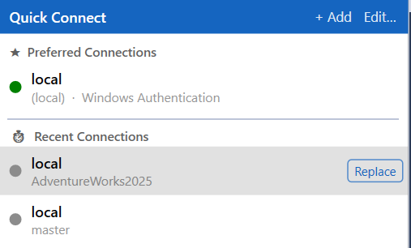

# What's New in SqlPulse

**v0.1.285 - 2026-04-02**

---

### Added
- **Object Explorer: Font size override** — configurable font size (8–24 pt) for the Object Explorer tree, settable in SqlPulse Settings → Object Groups. SSMS has a global font setting under Tools → Options → Environment → Fonts and Colors, but it affects the entire IDE and requires a restart; this setting applies instantly and is scoped to the Object Explorer only.
- **Object Explorer: Group by schema** — automatically groups Tables/Views/Stored Procedures into schema folders ("dbo (12)", "billing (5)") without manual rule setup; works alongside custom OE groups. Note: SSMS 22.4.1+ has a built-in "Group by schema" option (right-click the Tables node → Group by Schema), but it offers no color coding, no custom ordering, and no interaction with SqlPulse groups. This feature is available for all supported SSMS versions (18+).

### Changed
- **Quick Connect: Replace active tab** — hover over any connection in the Quick Connect popup to reveal a "Replace" button; clicking it switches the active query editor to that server/database without opening a new tab.
  
  

- **Profiler: Pluggable Storage Sink** — async write queue (`BlockingCollection`) decouples I/O from the poll thread; four sink types: Auto (temp file, always on), File (.jsonl.gz, kept after session), SQL Server (SqlBulkCopy batch insert, auto-creates table), SQLite (local .db file); sink switchable live without data loss; export commands (CSV/JSON/SQL) read from sink when available, no OOM on large sessions
- **Profiler: Auto temp file** — even in default mode all events are streamed to `%TEMP%\SqlPulse_*.jsonl`; file deleted on session clear or sink switch; path shown in toolbar
- **Profiler: Status bar** — shows `N total (M in memory)` when in-memory buffer is smaller than the full captured history

**v0.1.249 - 2026-03-31**

---

- Object Search window: added ESC shortcut to close the window

---

**v0.1.248 - 2026-03-31**

---

### Added
- **Dependency Viewer** — new window showing what a database object depends on and what uses it; supports direct (one-level) and recursive (full chain) modes; definition panel scripts the selected dependency inline
- **Object Search: View Dependencies** — "View Dependencies" button on selected search results opens the Dependency Viewer for that object
- **Editor context menu: View Dependencies** — SqlPulse → View Dependencies opens the Dependency Viewer directly from selected object name in any query editor
- **Version check

### Changed
- SMO scripting logic centralized into `ScriptObjectExecutor`; duplicate code removed from `ScriptObjectCommand` and `QueryEditorContextMenuInjector`
- `SqlObjectType.ToSmoCollection()` added as single source of truth for type → SMO collection mapping
- `SearchSmoHelper` delegation to `SmoScriptingService` fixed (was silently falling back to standalone mode inside SSMS due to wrong overload signature)
- Fix codeinspector

---

**v0.1.230 - 2026-03-29**

---

### Added
- **Keyboard Shortcuts** settings page — configurable shortcuts for all major features (Profiler, Query History, Plan Analyzer, Object Search, SQL Inspector, Quick Connect, Format SQL, Script Object)
- Foreground-only shortcut firing — hooks do not steal keystrokes from other applications
- Multi-shortcut support in `KeyboardHookService` with per-entry debounce
- **SQL Profiler** — live query capture via DMVs; blocking tree, top queries, wait stats panels; compressed session file export; one-click plan analysis for slow queries
- **Quick Connect** — floating dropdown with preferred + recent connections; toolbar button on Standard toolbar
- **Connection Strip** — thin colored bar at the bottom of every query editor showing server/database; color configurable per connection
- **Grid Conditional Formatting (Pro)** — color rows/cells by column value with 13 operators; zebra striping; condition rules override zebra layer
- **Important DB Alert** — colored floating banner on production database switch; server/database pattern matching with wildcards
- **Transaction Guard** — floating reminder for open transactions; auto-dismisses on commit/rollback
- **Object Search (Pro)** — full-text search across tables, views, procedures, functions with cached metadata
- **DB & Job Grouping (Pro)** — colored group folders in Object Explorer for databases and SQL Agent jobs
- **Plan Analyzer (Pro)** — visual execution plan tree, side-by-side plan comparison, table usage summary, operator search
- **Query Playbooks (Pro)** — multi-step query workflows with connection overrides
- **Advanced Grid Filter (Pro)** — multi-condition filters with AND/OR logic and 9 operators
- **IntelliSense schema cache warmup** — auto-warms on view attach for faster IntelliSense
- Dual build: internal VSIX (SSMS 21/22) + shell15 variant (SSMS 18/19/20)
- SMO schema cache builder for Object Search metadata

### Changed
- `KeyboardHookService` refactored: multi-shortcut list replaces single volatile fields
- Script Object shortcut moved from General settings to the new Keyboard Shortcuts page
- `ShortcutSettings.Normalize()` no longer forces "Ctrl+Shift+S" as default — allows empty key
- ThemeService refactored — consistent VS theme propagation across all settings pages
- Settings dialog (`UnifiedSettingsDialog`) unified into single tree-navigation window
- Connection detection: `DispatcherTimer` + `DTE.CommandEvents` 3-layer approach (no polling lag)
- Settings architecture: `SettingsService` singleton with clone pattern; `Normalize()` on every load
- Feature flags refactored: `FeatureFlags.IsPro` replaces scattered license checks

### Fixed
- `System.Windows.Forms.Timer` replaced by `DispatcherTimer` everywhere (WinForms timer silently fails in SSMS/WPF host)
- Installer: VSIXInstaller path fixed for SSMS 22+ (uses VS Installer service, not in-product installer)
- SQL Profiler: duplicate/malformed multi-line SQL normalization

---

[Back to README](README.md)
